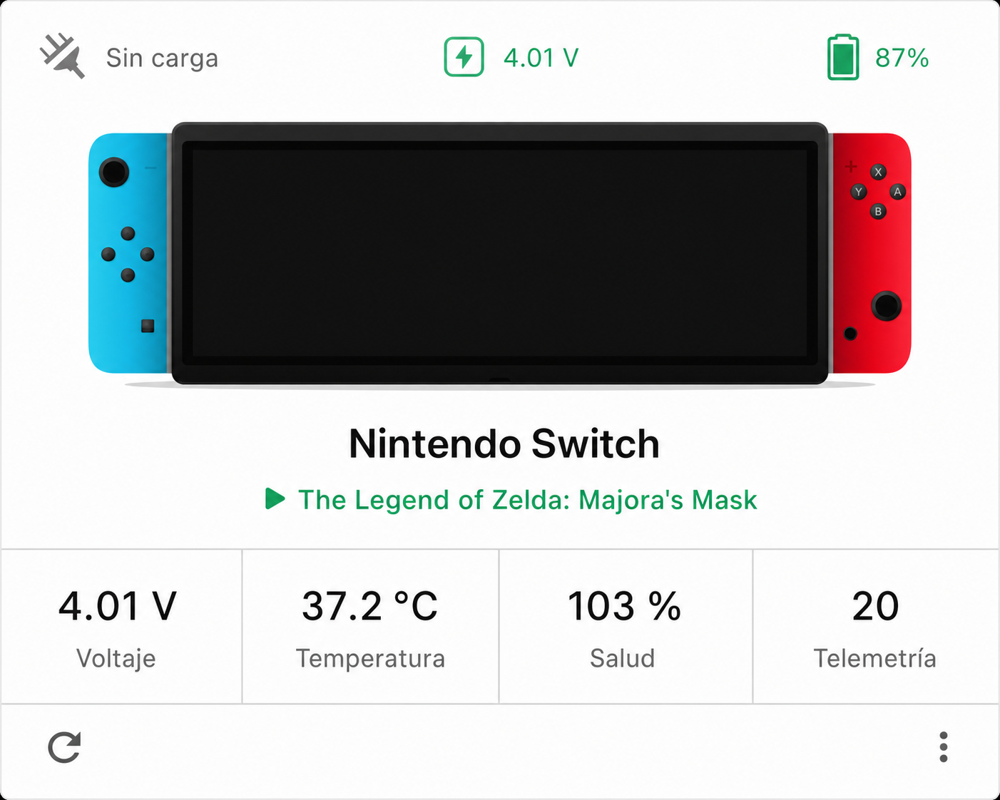

# Nintendo Switch Card

<p align="center">
  
</p>

An independent Home Assistant Lovelace port of [Nintendo Switch Card](https://github.com/hudsonbrendon/nintendo-switch-card), adapted by [rachosol](https://github.com/rachosol) for the native MQTT telemetry published by [Switch HA Native](https://github.com/rachosol/switch-ha-native-port).

The custom card name remains `custom:nintendo-switch-card` for compatibility. This port intentionally omits the retired streaming, notification, remote power, audio, controller and charger-type presentation from the original Switch Assistant-oriented setup.

## Original project

This port is based on the original [Nintendo Switch Card by Hudson Brendon](https://github.com/hudsonbrendon/nintendo-switch-card). Its source, design and MIT license are the foundation for this derivative work; the original copyright notice is preserved in [LICENSE](LICENSE).

## Features

- Header with battery percentage, charging state and battery voltage.
- Current game, including title IDs resolved by Switch HA Native.
- Freshness-aware console state using the telemetry heartbeat.
- Default stats for voltage, battery temperature and battery health.
- English, Spanish and Brazilian Portuguese user interface.
- Explicit entity overrides for installations whose Home Assistant entity IDs include a suffix such as `_2` after a prior MQTT discovery cleanup.

## Install

1. Copy `dist/nintendo-switch-card.js` to `/config/www/` in Home Assistant.
2. Add `/local/nintendo-switch-card.js` under **Settings → Dashboards → Resources** as a JavaScript module.
3. Add the card to a dashboard.

## Configuration

For a standard clean MQTT discovery, the prefix is enough:

```yaml
type: custom:nintendo-switch-card
entity: nintendo_switch
name: Nintendo Switch
language: en
```

If Home Assistant has assigned suffixes to the entities, configure the actual entity IDs explicitly. The following is the layout used by the native port after its first legacy-device cleanup:

```yaml
type: custom:nintendo-switch-card
name: Nintendo Switch
entities:
  battery_level: sensor.nintendo_switch_battery_level_2
  battery_voltage: sensor.nintendo_switch_battery_voltage_2
  battery_health: sensor.nintendo_switch_battery_health_2
  battery_temperature: sensor.nintendo_switch_battery_temperature_2
  is_charging: binary_sensor.nintendo_switch_is_charging_2
  game_running: binary_sensor.nintendo_switch_game_running_2
  current_game: sensor.nintendo_switch_current_game_2
  current_game_id: sensor.nintendo_switch_current_game_id
  telemetry_heartbeat: sensor.nintendo_switch_telemetry_heartbeat_2
```

Use the IDs listed in **Settings → Devices & services → Entities** for your own installation. The card needs `battery_level` and `is_charging`; the remaining entries are optional but enable their respective display features.

## Development

```bash
npm install
npm test
npm run typecheck
npm run build
```

## Attribution and license

This is a derivative port of Hudson Brendon's Nintendo Switch Card. The upstream MIT license is retained in [LICENSE](LICENSE); see [NOTICE.md](NOTICE.md) for the port attribution.

---

# Nintendo Switch Card (Español)

Port independiente de la tarjeta Lovelace [Nintendo Switch Card](https://github.com/hudsonbrendon/nintendo-switch-card), adaptado por [rachosol](https://github.com/rachosol) para la telemetría MQTT nativa de [Switch HA Native](https://github.com/rachosol/switch-ha-native-port).

Conserva el nombre `custom:nintendo-switch-card` para compatibilidad. Muestra porcentaje, estado de carga y voltaje de batería en el encabezado; además, juego actual, estado de consola, temperatura, salud y pulso de telemetría. Las funciones retiradas del esquema antiguo (streaming, notificaciones, controles remotos, audio, mandos y tipo de cargador) no forman parte de este port.

## Proyecto original

Este port se basa en el proyecto original [Nintendo Switch Card de Hudson Brendon](https://github.com/hudsonbrendon/nintendo-switch-card). Su código, diseño y licencia MIT son la base de este trabajo derivado; el aviso de copyright original se conserva en [LICENSE](LICENSE).

Para instalarla, copia `dist/nintendo-switch-card.js` a `/config/www/`, añade `/local/nintendo-switch-card.js` como recurso JavaScript y agrega una tarjeta al dashboard. La configuración de ejemplo en inglés es válida también en español. Si Home Assistant añade el sufijo `_2` tras una limpieza MQTT, usa los IDs reales de tu registro de entidades en la sección `entities`.

La licencia MIT original se conserva en [LICENSE](LICENSE) y la atribución del port está en [NOTICE.md](NOTICE.md).
